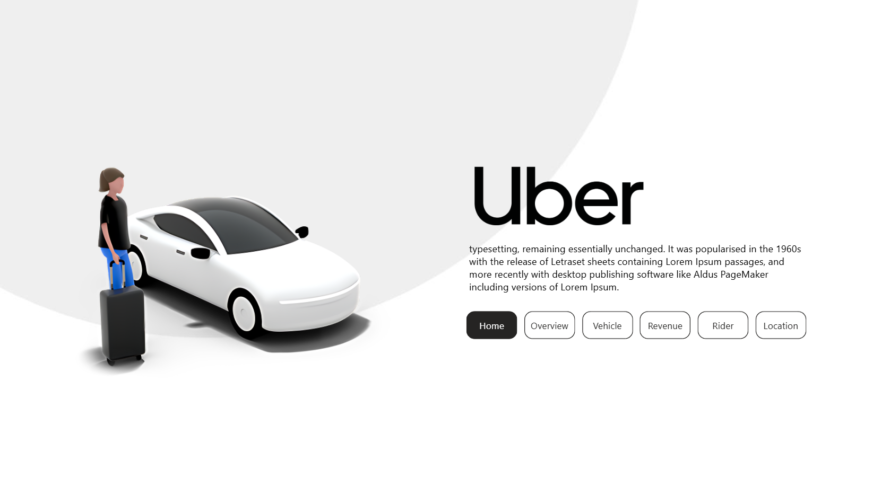
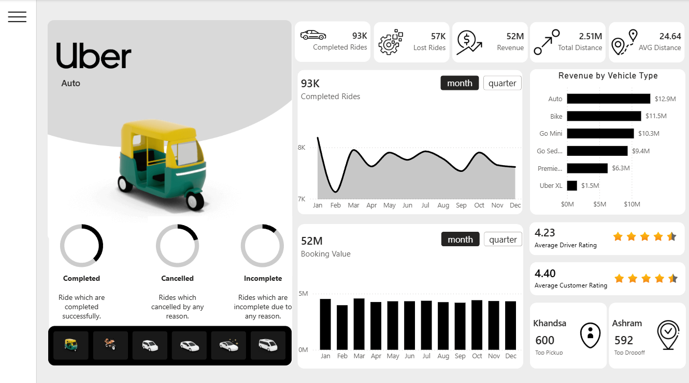
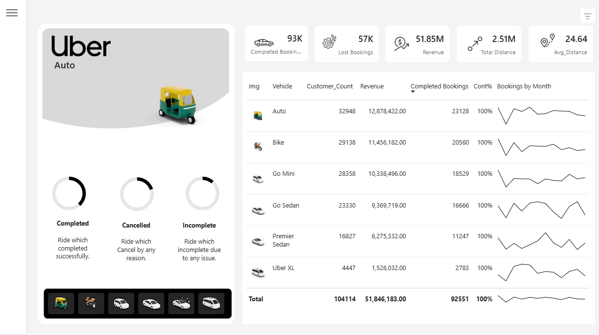
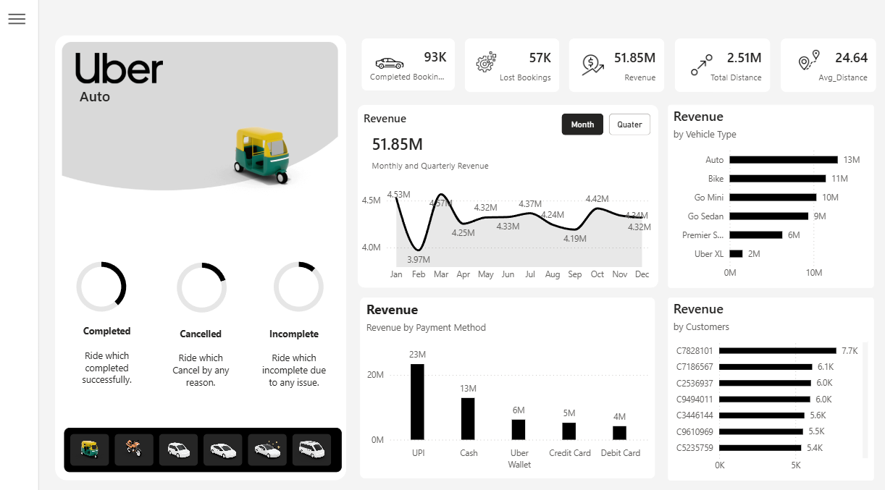
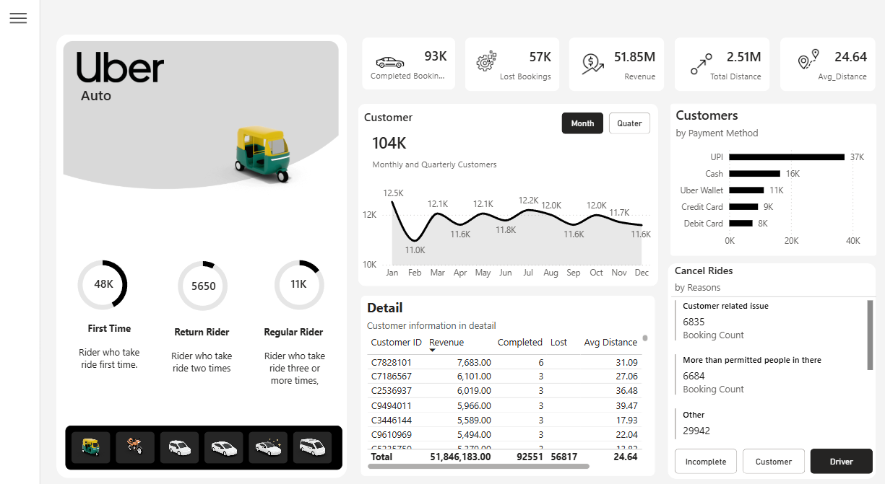
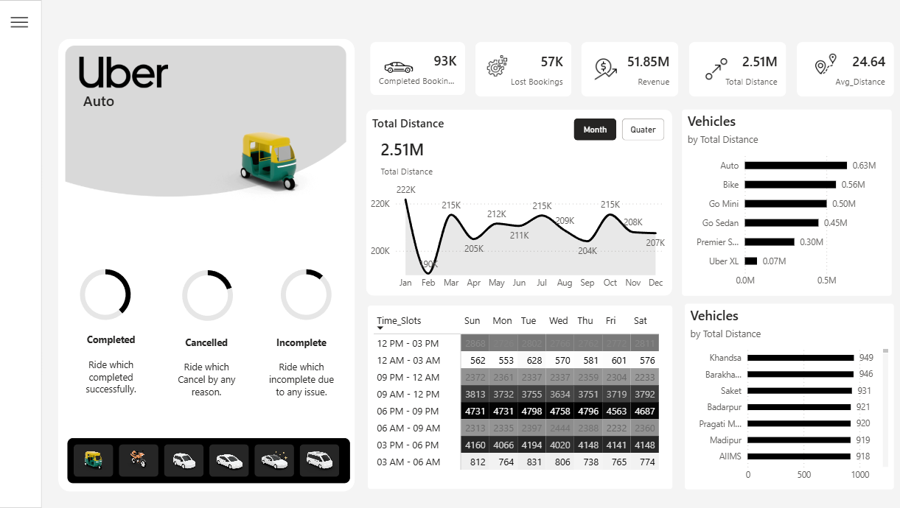

##Uber Ride Analytics Dashboard
Project Overview

The Uber Ride Analytics Dashboard is an end-to-end Business Intelligence project developed using Power BI, SQL, and Excel. It provides comprehensive insights into ride bookings, revenue, customer behavior, vehicle performance, trip cancellations, and operational efficiency through interactive dashboards.

Problem Statement

Ride-hailing companies generate massive amounts of trip data every day. Without effective visualization and analysis, identifying trends in revenue, customer behavior, cancellations, and fleet utilization becomes difficult.

This dashboard converts raw ride data into actionable business insights for decision-making.

Objectives
Monitor booking performance
Analyze revenue trends
Understand customer behavior
Evaluate vehicle performance
Track cancellation reasons
Identify high-performing locations
Monitor payment preferences
Dashboard Pages
## Home

## Overview

## Vehicle

## Revenue

## Rider

## Location

1. Overview Dashboard

Displays

Total Bookings
Revenue
Lost Bookings
Total Distance
Average Distance
Booking Status
Vehicle-wise Performance
2. Revenue Dashboard

Insights include

Monthly Revenue Trend
Revenue by Vehicle Type
Revenue by Payment Method
Highest Revenue Customers
3. Customer Dashboard

Analyzes

First-time Riders
Returning Customers
Regular Riders
Customer Details
Cancellation Reasons
Payment Preferences
4. Vehicle Dashboard

Shows

Distance Covered by Vehicle
Peak Time Slots
Vehicle Performance
Area-wise Distance Analysis
KPIs
Total Bookings
Completed Bookings
Lost Bookings
Revenue
Total Distance
Average Ride Distance
Customer Count
Cancellation Rate
Revenue by Vehicle
Revenue by Payment Method
Tools Used
Power BI
SQL
Excel
Power Query
DAX
Skills Demonstrated
Data Cleaning
Data Transformation
Data Modeling
DAX Calculations
Dashboard Design
Business Intelligence
Data Visualization
KPI Reporting
Interactive Reporting
Storytelling with Data
Business Insights
Auto rides generated the highest revenue.
UPI was the most preferred payment method.
Revenue remained relatively stable throughout the year.
A small number of customers contributed significantly to total revenue.
Cancellation analysis highlighted operational bottlenecks.
Vehicle performance varied significantly across ride categories.
